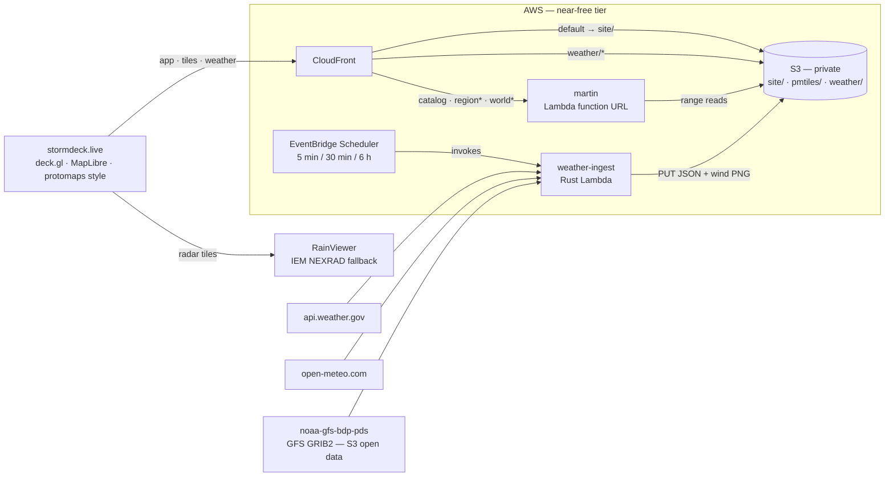

# stormdeck

**Live at [stormdeck.live](https://stormdeck.live).**

Live weather on a deck.gl map, served almost entirely from free tiers — the whole bill is thirteen dollars a year of vanity domain plus a few cents a month for Route 53 and SES email.

OpenStreetMap basemap tiles come from [martin](https://github.com/maplibre/martin) running **inside AWS Lambda**, reading [PMTiles](https://docs.protomaps.com/pmtiles/) extracts straight from a private S3 bucket. A scheduled Rust lambda ([cargo-lambda](https://www.cargo-lambda.info/)) snapshots US-wide NWS alerts plus two Open-Meteo conditions grids — a fine one over the home bbox and a 6° lattice covering the planet — and decodes NOAA GFS GRIB2 straight from NOAA's open-data S3 bucket into animated global wind and city-point forecasts (city list from GeoNames). Radar is RainViewer's global composite (IEM NEXRAD as fallback). The web app is React + deck.gl + MapLibre, served from the same CloudFront distribution as the tiles and weather — one origin, no CORS, hashed assets cached immutable at the edge. Map views mirror into the URL hash, so any view is a link.

> **Not an official weather source.** This is a hobby map on shoestring infrastructure: alerts refresh on a schedule, radar lags by several minutes, zone-based NWS alerts (no polygon geometry) are not shown, and any piece can fail silently with no on-map indication. For decisions involving life or property, use [weather.gov](https://www.weather.gov/) and local emergency guidance.



## What it costs

| Piece | Tier | Limit |
|---|---|---|
| Lambda (martin + ingest) | always free | 1M requests + 400k GB-s / month |
| CloudFront | always free | 1 TB egress + 10M requests / month |
| EventBridge Scheduler | always free | 14M invocations / month |
| S3 | free 12 months, then ~$0.02/GB-mo | a metro extract is ~$0.01/mo after year one |
| stormdeck.live (Route 53) | not free | $13/yr + $0.50/mo hosted zone |
| NWS, Open-Meteo, NOAA GFS, IEM radar, GeoNames, protomaps builds | free / open data | be polite, attribute |

CloudFront caches tiles hard (24h TTL), so martin invocations stay tiny.

## Prereqs

`mise install` ([mise](https://mise.jdx.dev/)) fetches the whole toolchain from `mise.toml`: `node` (LTS), `pnpm`, `rust`, [`just`](https://just.systems/), [`cargo-lambda`](https://www.cargo-lambda.info/), the [`pmtiles`](https://github.com/protomaps/go-pmtiles) CLI, and [`martin`](https://github.com/maplibre/martin) for local dev. (`rust-toolchain.toml` pulls in the arm64 cross target on first build.) Bring your own equivalents if you prefer. Either way you also need the `aws` CLI, authenticated.

## Deploy

```sh
# 1. cut OSM extracts: full detail for your area (default: DFW;
#    bbox=... to change) plus a small z0-6 world for zoomed-out context
just tiles extract

# 2. package the martin lambda zip from the upstream prebuilt arm64
#    binary (weather-ingest compiles itself at deploy time, via CDK)
just build martin

# 3. one-time account setup; afterwards every push to main that touches
#    cdk/ or crates/ deploys via GitHub OIDC (no stored AWS keys)
just profile=<admin> cdk bootstrap
just profile=<admin> cdk deploy oidc
gh variable set AWS_DEPLOY_ROLE_ARN \
  --body "$(just profile=<admin> cdk output DeployRoleArn StormdeckGithubOidc)"
git push    # deploy-infra applies the stack (or locally: just cdk deploy)

# 4. ship the tiles, prime the weather data
just tiles upload
just weather prime

# 5. tell deploy-web which distribution to invalidate, then publish
gh variable set DISTRIBUTION_ID --body "$(just cdk output DistributionId)"
gh workflow run deploy-web.yml
```

After that, `deploy-web` republishes on any push that touches `web/` (an S3 sync plus an index invalidation — hashed assets are immutable), and `deploy-infra` redeploys on anything touching `cdk/` or `crates/`.

## Development & releases

Work on a branch and open a PR — `ci` runs on every PR (web build + biome, Rust fmt/clippy/contract-drift, cdk typecheck + synth). Merging to `main` is what ships: the same push triggers `deploy-web` / `deploy-infra` (continuous deployment).

Docs ship with the change: any PR that alters data sources, behavior, costs, or architecture updates the README and the on-map attribution (`web/src/App.tsx` and `web/src/basemap.ts`) in the same PR. `ci` can't catch stale prose, so [the PR checklist](.github/pull_request_template.md) is the backstop — keep a source uncredited and you've shipped a licensing bug, not just a doc gap.

Every merge also cuts a **patch release automatically** (`auto-release.yml`): it bumps the latest `vX.Y.Z` tag, tags the merge commit, and creates a GitHub Release with notes auto-generated from the PRs merged since the last tag — so PR titles are the changelog (label them to sort into the sections in `.github/release.yml`). The first merge with no tags yet seeds `v0.1.0`. The deployed app stamps that same version next to the title and in a console banner (`deploy-web` computes it the same way), so the live label always reads the released `vX.Y.Z` — exactly what's live.

For a bigger bump, or to release by hand, use `just release` from a clean, pushed `main`:

```sh
just release minor      # or major — bump + push the tag yourself
just release 0.1.0      # an exact version
```

A manual tag is pushed with your own credentials, so it fires `release.yml` (the manual path) instead of `auto-release`. To skip the release for a trivial merge, put `[skip release]` in the **PR title** (the squash subject — only the subject line is checked). To roll back, revert via a PR and merge — CD redeploys and the next patch is cut.

## Local dev

The quick way — `just web dev` runs the app against the **live site's** tiles + weather, so there's no local backend to stand up:

```sh
pnpm --dir web install   # once
just web dev             # http://localhost:5173, data from stormdeck.live
```

For offline / tile / basemap work, run the full local stack instead — martin serving local extracts, vite serving locally-primed weather:

```sh
just tiles extract  # once: cut the pmtiles
just weather local  # live weather → web/public/weather/
just dev            # martin :3030 + vite :5173 (local data, overrides the default)
```

## IaC

CDK → CloudFormation: state lives in the account, and pushes to `main` deploy through the repo-pinned OIDC role (the `StormdeckGithubOidc` stack from step 3). `just cdk synth` works offline, and the `profile=` / `region=` variables (`.just/common.just`) thread through every infra recipe (`cdk bootstrap`, `cdk deploy`, `cdk outputs`, `tiles upload`, `weather prime`, …). Module justfiles live in their home folders, so e.g. `just deploy` from inside `cdk/` works too.

One piece lives outside CloudFormation: the stormdeck.live certificate was requested once via the ACM CLI in us-east-1 (CloudFront only takes certs from there) and is pinned by ARN in the stack. Its DNS validation records *are* stack-managed, so renewals stay hands-off. Mind the CAA gotcha: ACM follows CAA policy through CNAMEs, so a record pointing at a host with restrictive CAA (github.io, say) blocks issuance for that name.

## Configuration

| Knob | Where | Default |
|---|---|---|
| `bbox` (fine grid + tile detail) | `.just/common.just` / `cdk/lib/stormdeck-stack.ts` | `-98.2,31.8,-95.8,33.6` (DFW) |
| `nws_area` | same | empty (all US alerts) |
| Global lattice spacing | `GLOBAL_STEP_DEG` lambda env | 6° |
| Global/regional grid switch | `GRID_ZOOM_SPLIT` in `web/src/config.ts` | z6.5 |
| Map start view | `web/src/config.ts` (URL hash wins) | world, z0 |
| World context detail | `WORLD_MAXZOOM` env for `just tiles extract` | z0–6 |
| Schedules | `cdk/lib/stormdeck-stack.ts` | alerts 5 min, grid 30 min, global 6 h |
| Grid density | `GRID_COLS`/`GRID_ROWS` lambda env | 8×6 |

Keep the three in sync: tile extract bbox, weather bbox, initial view.

## Notes

- **martin-in-Lambda**: martin ≥ v0.14 detects `AWS_LAMBDA_RUNTIME_API` and serves Lambda events natively — the zip is just the upstream `aarch64-musl` binary plus a two-line `bootstrap`. The function URL is IAM-auth; only CloudFront (OAC SigV4) may invoke it.
- **No aws-sdk in the ingester**: it only PUTs a handful of small objects — JSON snapshots plus the GFS wind PNGs — so it signs the request itself (SigV4, ~80 lines, test vector included). As of June 2026 the SDK also doesn't compile (aws-runtime 1.7.4 vs aws-smithy-runtime-api 1.12.3 skew) — check back later if you need more S3 surface.
- **Zone-based NWS alerts** (no polygon geometry) are dropped; rendering them would mean shipping zone shapefiles. Counted in the lambda logs.
- **Open-Meteo counts each lattice point as an API call**, so the global job paces its batches 15s apart (their 600/min cap) and the default schedules add up to ~9k calls/day against their 10k non-commercial tier. Densify the lattice or speed up the schedules and you'll start seeing 429s — the lambda backs off and retries once, but budget first.
- **GFS straight from GRIB2**: wind and the city-point temps skip Open-Meteo's per-point metering — the ingester pulls 0.25° UGRD/VGRD/TMP fields from NOAA's public `noaa-gfs-bdp-pds` S3 bucket and decodes the GRIB2 itself, so one ~0.9 MB field covers the whole planet (1440×721) and any number of cities sample for free. Wind ships to the web as a normalized u/v PNG (±40 m/s), city temps as tile JSON; both carry the model run's snapshot in the path so a new run refetches cleanly.

## Attribution

Map data © [OpenStreetMap](https://openstreetmap.org/copyright) contributors, tiles via [Protomaps](https://protomaps.com) builds (ODbL). Radar: [RainViewer](https://www.rainviewer.com/) global composite (free tier, attribution required), falling back to NOAA NEXRAD via the [Iowa Environmental Mesonet](https://mesonet.agron.iastate.edu/). Alerts: [National Weather Service](https://www.weather.gov/) (public domain). Conditions: [Open-Meteo](https://open-meteo.com/) (CC-BY 4.0). Wind and city forecasts: [NOAA GFS](https://registry.opendata.aws/noaa-gfs-bdp-pds/) via NOAA Open Data Dissemination (public domain). City list: [GeoNames](https://www.geonames.org/) (CC-BY 4.0).

MIT.
