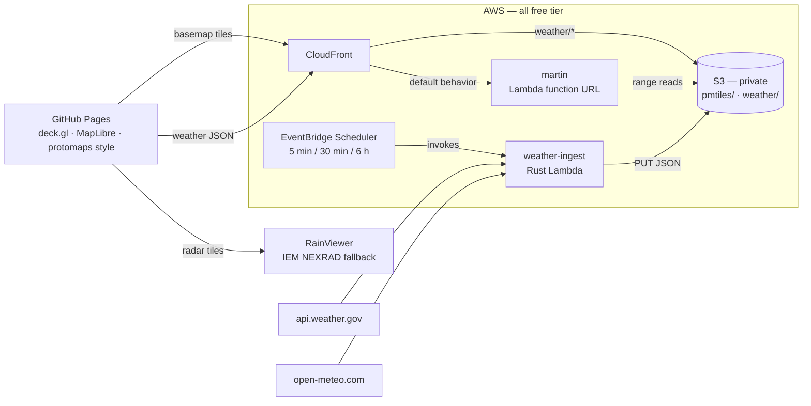

# stormdeck

**Live at [stormdeck.live](https://stormdeck.live).**

Live weather on a deck.gl map, served entirely from free tiers
(plus thirteen dollars a year of vanity domain).

OpenStreetMap basemap tiles come from [martin](https://github.com/maplibre/martin)
running **inside AWS Lambda**, reading [PMTiles](https://docs.protomaps.com/pmtiles/)
extracts straight from a private S3 bucket. A scheduled Rust lambda
([cargo-lambda](https://www.cargo-lambda.info/)) snapshots US-wide NWS
alerts plus two Open-Meteo conditions grids — a fine one over the home
bbox and a 6° lattice covering the planet. Radar is RainViewer's global
composite (IEM NEXRAD as fallback). The web app is React + deck.gl +
MapLibre on GitHub Pages.

> **Not an official weather source.** This is a hobby map on free-tier
> infrastructure: alerts refresh on a schedule, radar lags by several
> minutes, zone-based NWS alerts (no polygon geometry) are not shown,
> and any piece can fail silently with no on-map indication. For
> decisions involving life or property, use [weather.gov](https://www.weather.gov/)
> and local emergency guidance.



## What it costs

| Piece | Tier | Limit |
|---|---|---|
| Lambda (martin + ingest) | always free | 1M requests + 400k GB-s / month |
| CloudFront | always free | 1 TB egress + 10M requests / month |
| EventBridge Scheduler | always free | 14M invocations / month |
| GitHub Pages | free | public repos |
| S3 | free 12 months, then ~$0.02/GB-mo | a metro extract is ~$0.01/mo after year one |
| stormdeck.live (Route 53) | not free | $13/yr + $0.50/mo hosted zone |
| NWS, Open-Meteo, IEM radar, protomaps builds | free / open data | be polite, attribute |

CloudFront caches tiles hard (24h TTL), so martin invocations stay tiny.

## Prereqs

`mise install` ([mise](https://mise.jdx.dev/)) fetches the whole
toolchain from `mise.toml`: `node` (LTS), `pnpm`, `rust`,
[`just`](https://just.systems/), [`cargo-lambda`](https://www.cargo-lambda.info/),
the [`pmtiles`](https://github.com/protomaps/go-pmtiles) CLI, and
[`martin`](https://github.com/maplibre/martin) for local dev.
(`rust-toolchain.toml` pulls in the arm64 cross target on first
build.) Bring your own equivalents if you prefer. Either way you
also need the `aws` CLI, authenticated.

## Deploy

```sh
# 1. cut OSM extracts: full detail for your area (default: DFW;
#    bbox=... to change) plus a small z0-6 world for zoomed-out context
just tiles extract

# 2. build both lambda zips: weather-ingest via cargo-lambda,
#    martin from the upstream prebuilt arm64 binary
just build lambdas

# 3. one-time account setup; afterwards every push to main that touches
#    cdk/ or crates/ deploys via GitHub OIDC (no stored AWS keys)
just profile=<admin> cdk bootstrap
just profile=<admin> cdk deploy oidc
gh variable set AWS_DEPLOY_ROLE_ARN \
  --body "$(just profile=<admin> cdk output DeployRoleArn StormdeckGithubOidc)"
gh api -X POST repos/<you>/stormdeck/pages -f build_type=workflow
git push    # deploy-infra applies the stack (or locally: just cdk deploy)

# 4. ship the tiles, prime the weather data
just tiles upload
just weather prime

# 5. point the web app at CloudFront and republish
gh variable set API_BASE --body "$(just cdk output ApiBase)"
gh workflow run deploy-web.yml
```

After that, `deploy-web` republishes on any push that touches `web/`,
and `deploy-infra` redeploys on anything touching `cdk/` or `crates/`.

## Local dev

```sh
just tiles extract  # once
just weather local  # live weather → web/public/weather/
just dev            # martin :3030 + vite :5173
```

## IaC

CDK → CloudFormation: state lives in the account, and pushes to
`main` deploy through the repo-pinned OIDC role (the `StormdeckGithubOidc`
stack from step 3). `just cdk synth` works offline, and the
`profile=` / `region=` variables (`.just/common.just`) thread through
every infra recipe (`cdk bootstrap`, `cdk deploy`, `cdk outputs`,
`tiles upload`, `weather prime`, …). Module justfiles live in their
home folders, so e.g. `just deploy` from inside `cdk/` works too.

## Configuration

| Knob | Where | Default |
|---|---|---|
| `bbox` (fine grid + tile detail) | `.just/common.just` / `cdk/lib/stormdeck-stack.ts` | `-98.2,31.8,-95.8,33.6` (DFW) |
| `nws_area` | same | empty (all US alerts) |
| Global lattice spacing | `GLOBAL_STEP_DEG` lambda env | 6° |
| Global/regional grid switch | `GRID_ZOOM_SPLIT` in `web/src/config.ts` | z6.5 |
| Map start view | `web/src/config.ts` | DFW, z8 |
| World context detail | `WORLD_MAXZOOM` env for `just tiles extract` | z0–6 |
| Schedules | `cdk/lib/stormdeck-stack.ts` | alerts 5 min, grid 30 min, global 6 h |
| Grid density | `GRID_COLS`/`GRID_ROWS` lambda env | 8×6 |

Keep the three in sync: tile extract bbox, weather bbox, initial view.

## Notes

- **martin-in-Lambda**: martin ≥ v0.14 detects `AWS_LAMBDA_RUNTIME_API` and
  serves Lambda events natively — the zip is just the upstream
  `aarch64-musl` binary plus a two-line `bootstrap`. The function URL is
  IAM-auth; only CloudFront (OAC SigV4) may invoke it.
- **No aws-sdk in the ingester**: it only PUTs two small JSON files, so it
  signs the request itself (SigV4, ~80 lines, test vector included). As of
  June 2026 the SDK also doesn't compile (aws-runtime 1.7.4 vs
  aws-smithy-runtime-api 1.12.3 skew) — check back later if you need more
  S3 surface.
- **Zone-based NWS alerts** (no polygon geometry) are dropped; rendering
  them would mean shipping zone shapefiles. Counted in the lambda logs.
- **Open-Meteo counts each lattice point as an API call**, so the global
  job paces its batches 15s apart (their 600/min cap) and the default
  schedules add up to ~9k calls/day against their 10k non-commercial tier.
  Densify the lattice or speed up the schedules and you'll start seeing
  429s — the lambda backs off and retries once, but budget first.

## Attribution

Map data © [OpenStreetMap](https://openstreetmap.org/copyright) contributors,
tiles via [Protomaps](https://protomaps.com) builds (ODbL). Radar:
[RainViewer](https://www.rainviewer.com/) global composite (free tier,
attribution required), falling back to NOAA NEXRAD via the
[Iowa Environmental Mesonet](https://mesonet.agron.iastate.edu/).
Alerts: [National Weather Service](https://www.weather.gov/) (public domain).
Conditions: [Open-Meteo](https://open-meteo.com/) (CC-BY 4.0).

MIT.
