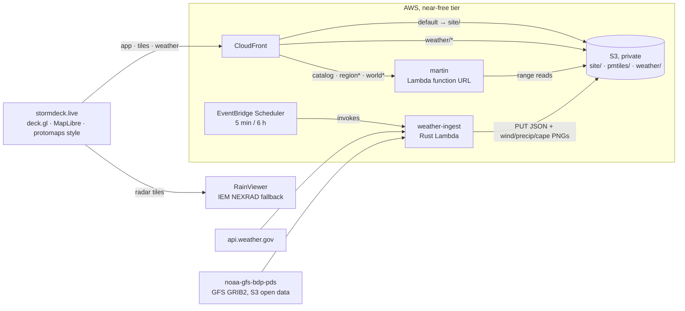

# stormdeck

**Live at [stormdeck.live](https://stormdeck.live).**


Live weather on a deck.gl map, served almost entirely from free tiers: the whole bill is thirteen dollars a year of vanity domain plus a few cents a month for Route 53 and SES email.

OpenStreetMap basemap tiles come from [martin](https://github.com/maplibre/martin) running **inside AWS Lambda**, reading [PMTiles](https://docs.protomaps.com/pmtiles/) extracts straight from a private S3 bucket. A scheduled Rust lambda ([cargo-lambda](https://www.cargo-lambda.info/)) snapshots US-wide NWS alerts and decodes NOAA GFS GRIB2 straight from NOAA's open-data S3 bucket into global 2 m temperatures (a planet-wide lattice when zoomed out, per-city point forecasts when zoomed in), animated global wind, a global precipitation forecast (GFS composite reflectivity), and a global storm-potential overlay (GFS surface CAPE) — city list from GeoNames. Precipitation shows the live RainViewer global radar composite (IEM NEXRAD as fallback) while the timeline is parked at *now*, then swaps to the GFS forecast raster as you scrub forward, so the whole map moves on one timeline. Storm potential (off by default) shades where the atmosphere is primed for thunderstorms, alongside the live NWS alerts. The web app is React + deck.gl + MapLibre, served from the same CloudFront distribution as the tiles and weather: one origin, no CORS, hashed assets cached immutable at the edge. Map views mirror into the URL hash, so any view is a link.

> **Not an official weather source.** This is a hobby map on shoestring infrastructure: alerts refresh on a schedule, live radar lags by several minutes, the forecast precipitation is coarse 0.25° model output (it smooths over individual cells), zone-based NWS alerts (no polygon geometry) are not shown, and any piece can fail silently with no on-map indication. For decisions involving life or property, use [weather.gov](https://www.weather.gov/) and local emergency guidance.



## What it costs

| Piece | Tier | Limit |
|---|---|---|
| Lambda (martin + ingest) | always free | 1M requests + 400k GB-s / month |
| CloudFront | always free | 1 TB egress + 10M requests / month |
| EventBridge Scheduler | always free | 14M invocations / month |
| S3 | free 12 months, then ~$0.02/GB-mo | a metro extract is ~$0.01/mo after year one |
| stormdeck.live (Route 53) | not free | $13/yr + $0.50/mo hosted zone |
| NWS, NOAA GFS, IEM radar, GeoNames, protomaps builds | free / open data | be polite, attribute |

CloudFront caches tiles hard (24h TTL), so martin invocations stay tiny.

## Prereqs

`mise install` ([mise](https://mise.jdx.dev/)) fetches the whole toolchain from `mise.toml`: `node` (LTS), `pnpm`, `rust`, [`just`](https://just.systems/), [`cargo-lambda`](https://www.cargo-lambda.info/), the [`pmtiles`](https://github.com/protomaps/go-pmtiles) CLI, and [`martin`](https://github.com/maplibre/martin) for local dev. (`rust-toolchain.toml` pulls in the arm64 cross target on first build.) Bring your own equivalents if you prefer. Either way you also need the `aws` CLI, authenticated.

## Deploy

```sh
# 1. cut OSM extracts: full detail for your area (default: DFW;
#    bbox=... to change) plus a small z0-6 world for zoomed-out context
just tiles extract

# 2. package the martin lambda zip from the upstream prebuilt arm64
#    binary (weather-ingest compiles itself at deploy time, via CDK)
just build martin

# 3. one-time account setup; afterwards every push to main that touches
#    cdk/ or crates/ deploys via GitHub OIDC (no stored AWS keys)
just profile=<admin> cdk bootstrap
just profile=<admin> cdk deploy oidc
gh variable set AWS_DEPLOY_ROLE_ARN \
  --body "$(just profile=<admin> cdk output DeployRoleArn StormdeckGithubOidc)"
git push    # the deploy workflow applies the stack (or locally: just cdk deploy)

# 4. ship the tiles, prime the weather data
just tiles upload
just weather prime

# 5. tell deploy which distribution to invalidate, then publish
gh variable set DISTRIBUTION_ID --body "$(just cdk output DistributionId)"
gh workflow run deploy.yml
```

After that, the single `deploy` workflow republishes on any push to `main`: a change under `cdk/` or `crates/` redeploys the stack and re-primes the weather feeds, and a change under `web/` publishes the app (an S3 sync plus an index invalidation: hashed assets are immutable). When a merge touches both, the web job waits for the infra job, so the app never goes live ahead of the backend (and data) it reads.

## Development & releases

Work on a branch and open a PR; `ci` runs on every PR (web build + biome, Rust fmt/clippy/contract-drift, cdk typecheck + synth). Merging to `main` is what ships: the push triggers the `deploy` workflow (continuous deployment): infra first (stack deploy + feed priming), then the web, so the app never publishes ahead of its backend.

Docs ship with the change: any PR that alters data sources, behavior, costs, or architecture updates the README and the on-map attribution (`web/src/App.tsx` and `web/src/basemap.ts`) in the same PR. `ci` can't catch stale prose, so [the PR checklist](.github/pull_request_template.md) is the backstop. Keep a source uncredited and you've shipped a licensing bug, not just a doc gap.

Every merge also cuts a **patch release automatically** (`auto-release.yml`): it bumps the latest `vX.Y.Z` tag, tags the merge commit, and creates a GitHub Release with notes auto-generated from the PRs merged since the last tag, so PR titles are the changelog (label them to sort into the sections in `.github/release.yml`). The first merge with no tags yet seeds `v0.1.0`. The deployed app stamps that same version next to the title and in a console banner (the `deploy` workflow computes it the same way), so the live label always reads the released `vX.Y.Z`, exactly what's live.

For a bigger bump, or to release by hand, use `just release` from a clean, pushed `main`:

```sh
just release minor      # or major, bump + push the tag yourself
just release 0.1.0      # an exact version
```

A manual tag is pushed with your own credentials, so it fires `release.yml` (the manual path) instead of `auto-release`. To skip the release for a trivial merge, put `[skip release]` in the **PR title** (the squash subject: only the subject line is checked). To roll back, revert via a PR and merge. CD redeploys and the next patch is cut.

## Local dev

The quick way: `just web dev` runs the app against the **live site's** tiles + weather, so there's no local backend to stand up:

```sh
pnpm --dir web install   # once
just web dev             # http://localhost:5173, data from stormdeck.live
```

For offline / tile / basemap work, run the full local stack instead, martin serving local extracts, vite serving locally-primed weather:

```sh
just tiles extract  # once: cut the pmtiles
just weather local  # live weather → web/public/weather/
just dev            # martin :3030 + vite :5173 (local data, overrides the default)
```

## IaC

CDK → CloudFormation: state lives in the account, and pushes to `main` deploy through the repo-pinned OIDC role (the `StormdeckGithubOidc` stack from step 3). `just cdk synth` works offline, and the `profile=` / `region=` variables (`.just/common.just`) thread through every infra recipe (`cdk bootstrap`, `cdk deploy`, `cdk outputs`, `tiles upload`, `weather prime`, …). Module justfiles live in their home folders, so e.g. `just deploy` from inside `cdk/` works too.

One piece lives outside CloudFormation: the stormdeck.live certificate was requested once via the ACM CLI in us-east-1 (CloudFront only takes certs from there) and is pinned by ARN in the stack. Its DNS validation records *are* stack-managed, so renewals stay hands-off. Mind the CAA gotcha: ACM follows CAA policy through CNAMEs, so a record pointing at a host with restrictive CAA (github.io, say) blocks issuance for that name.

## Configuration

| Knob | Where | Default |
|---|---|---|
| `bbox` (tile extract detail) | `.just/common.just` | `-98.2,31.8,-95.8,33.6` (DFW) |
| `nws_area` | `.just/common.just` / `cdk/lib/stormdeck-stack.ts` | empty (all US alerts) |
| Temp lattice spacing | `LATTICE_STEP_DEG` in `crates/weather-ingest/src/main.rs` | 6° |
| Lattice ↔ city temp switch | `GRID_ZOOM_SPLIT` in `web/src/config.ts` | z6.5 |
| Map start view | `web/src/config.ts` (URL hash wins) | world, z0 |
| World context detail | `WORLD_MAXZOOM` env for `just tiles extract` | z0-6 |
| Schedules | `cdk/lib/stormdeck-stack.ts` | alerts 5 min; temp / windtex / refc / cape 6 h |

The `bbox` sets the full-detail basemap region; outside it the map shows the coarse world tiles. Temperature, wind, the precipitation forecast, and storm potential are global (GFS), so they ignore it.

## Notes

- **martin-in-Lambda**: martin ≥ v0.14 detects `AWS_LAMBDA_RUNTIME_API` and serves Lambda events natively. The zip is just the upstream `aarch64-musl` binary plus a two-line `bootstrap`. The function URL is IAM-auth; only CloudFront (OAC SigV4) may invoke it.
- **No aws-sdk in the ingester**: it only PUTs a handful of small objects, JSON snapshots plus the GFS wind PNGs, so it signs the request itself (SigV4, ~80 lines, test vector included). As of June 2026 the SDK also doesn't compile (aws-runtime 1.7.4 vs aws-smithy-runtime-api 1.12.3 skew). Check back later if you need more S3 surface.
- **Zone-based NWS alerts** (no polygon geometry) are dropped; rendering them would mean shipping zone shapefiles. Counted in the lambda logs.
- **GFS straight from GRIB2**: temperature, wind, the precipitation forecast, and storm potential all come from NOAA GFS with no per-point API metering: the ingester pulls 0.25° UGRD/VGRD/TMP/REFC/CAPE fields from NOAA's public `noaa-gfs-bdp-pds` S3 bucket and decodes the GRIB2 itself, so one ~0.9 MB field covers the whole planet (1440×721) and any number of points sample for free. One pass writes a whole-planet `lattice.json` (the zoomed-out grid) plus per-city tiles (zoomed in), sampled from the same TMP fields, so the grid costs no extra fetches; the wind u/v PNGs (±40 m/s); the precipitation PNGs (composite reflectivity, a grayscale dBZ texture over −20…75 dBZ — GFS floors clear sky at ~−20 dBZ, so the web renders that transparent); and the storm-potential PNGs (surface CAPE, a grayscale texture over 0…5000 J/kg, faded out below ~250 J/kg). All carry the model run's snapshot so a new run refetches cleanly, and all share one forecast-hour axis so the timeline scrubs grid, cities, wind, precipitation, and storm potential together.

## Attribution

Map data © [OpenStreetMap](https://openstreetmap.org/copyright) contributors, tiles via [Protomaps](https://protomaps.com) builds (ODbL). Radar: [RainViewer](https://www.rainviewer.com/) global composite (free tier, attribution required), falling back to NOAA NEXRAD via the [Iowa Environmental Mesonet](https://mesonet.agron.iastate.edu/). Alerts: [National Weather Service](https://www.weather.gov/) (public domain). Temperatures, wind, the precipitation forecast (composite reflectivity), and storm potential (surface CAPE): [NOAA GFS](https://registry.opendata.aws/noaa-gfs-bdp-pds/) via NOAA Open Data Dissemination (public domain). City list: [GeoNames](https://www.geonames.org/) (CC-BY 4.0).

MIT.
